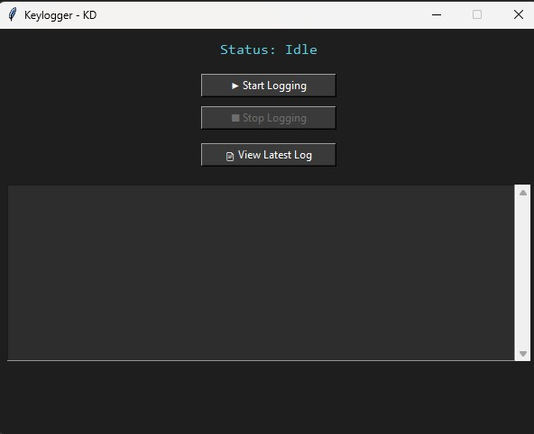

# 🕵️‍♂️ Keylogger: Dark Mode GUI Keylogger

A Python-based keylogger with a modern **dark-themed GUI**, designed for educational and ethical research purposes only. It allows real-time keystroke logging, log viewing, and log management — all through an intuitive interface.

> ⚠️ **Disclaimer:** This tool is intended for **educational** and **authorized use only**. Do not use it on devices or systems without proper consent.

---

## 🎨 GUI Preview



---

## 🚀 Features

- 🔑 Real-time keystroke logging
- 🎨 Dark mode Tkinter-based GUI
- 📂 Log viewer and logger control
- 🧼 Clear log button for easy management
- ⚙️ Command-line interface (CLI) version included

---

## 🛠️ Files Included

| File           | Description                                   |
|----------------|-----------------------------------------------|
| `logger.py`    | Core keylogging logic                         |
| `gui_app.py`   | Dark-themed GUI application using Tkinter     |
| `viewer.py`    | View logs in a separate GUI window            |
| `cli.py`       | Command-line interface version                |
| `Keylogger_Gui.jpg` | Screenshot of the GUI                    |
| `.gitignore`   | Git ignore configuration                      |
| `README.md`    | This file                                     |

---

## 📦 Requirements

- Python 3.x
- `pynput`
- `tkinter` (built-in with Python on most systems)

Install required packages:

```bash
pip install pynput
``` 


🖥️ How to Run

🔹 GUI Version
```bash
python gui_app.py
```

🔹 CLI Version
```bash
python cli.py
```
